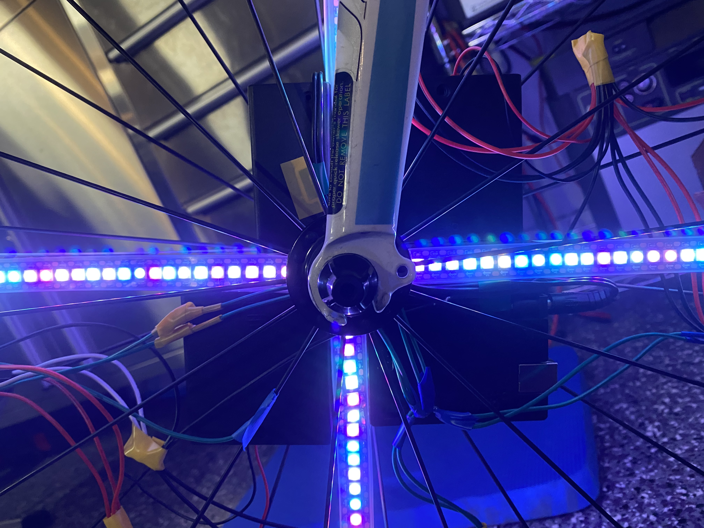

<html>
<h1>LED Wheel Lights</h1>

A D.I.Y. project using an Arduino UNO to drive 8 WS2812b LED light strips. The LED light strips are positioned in a cross on a bike wheel and when the wheel is spun, a variety of different image patterns can be created, including but not limited to moving concentric circles, spirals, and a solid disc that gradually changes color. Support for still images is still in the development stage. 

</html>

